# Middle Farallon Sea Palm Sanctuary - Project Plan

## Overview

This document serves as the master plan for the Middle Farallon Sea Palm Sanctuary project. It outlines the various systems and components that will make up our informational site and conservation research platform.

## Project Structure

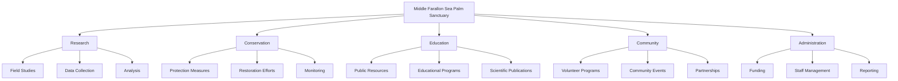

## Directory Structure

The project will be organized into the following directories, each containing specific Markdown files with Mermaid diagrams:

1. `/research/` - All research-related documentation and systems
2. `/conservation/` - Conservation strategies and implementation plans
3. `/education/` - Educational resources and program outlines
4. `/community/` - Community engagement and volunteer management
5. `/administration/` - Administrative systems and processes

## Detailed System Plans

### Research Systems

#### Field Study Protocol System

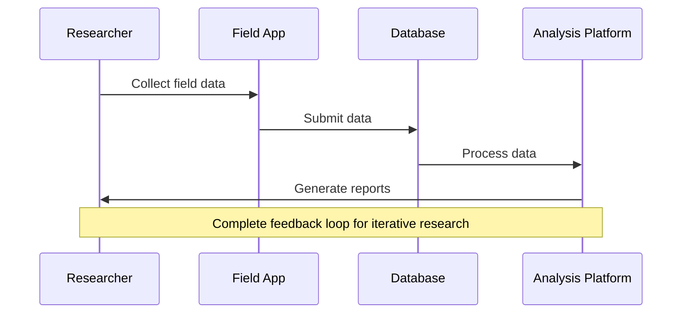

#### Data Collection System

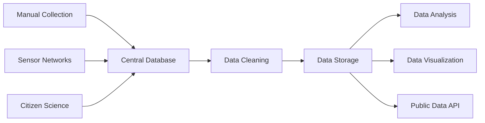

#### Research Analysis Framework

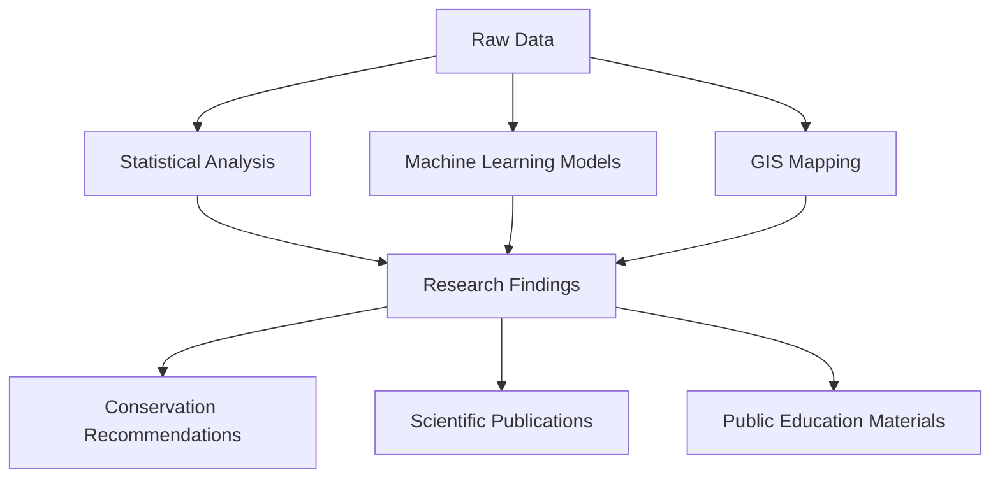

### Conservation Systems

#### Protection Implementation System

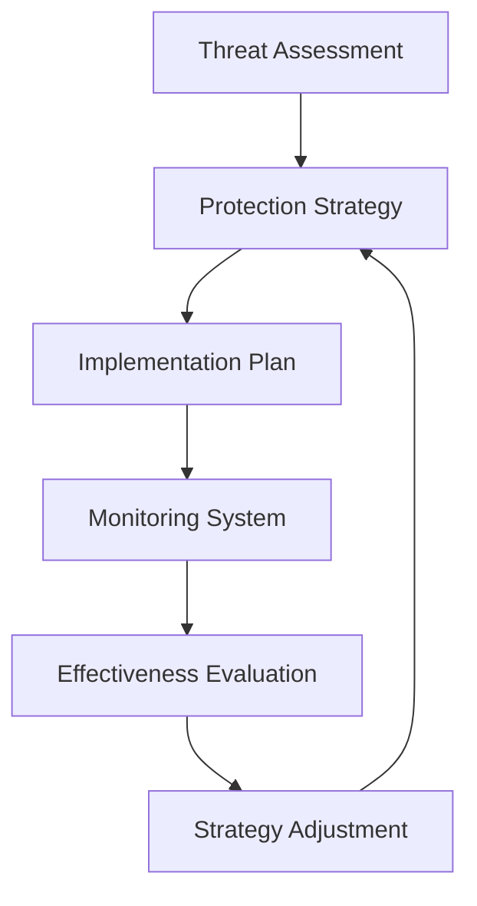

#### Restoration Project Management

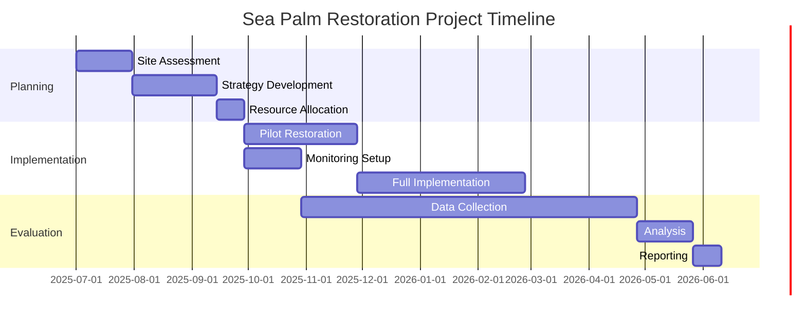

#### Monitoring System Architecture

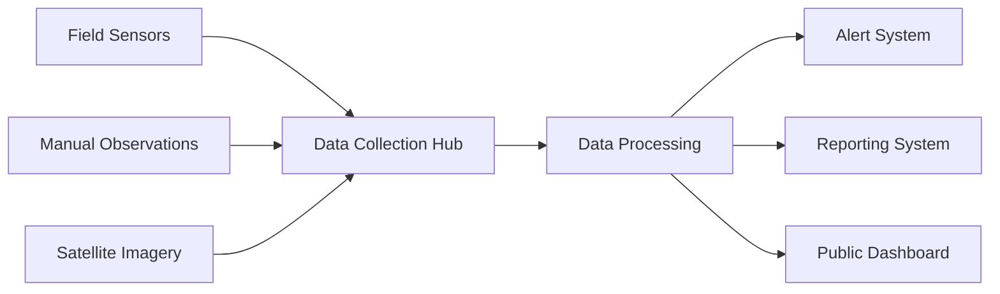

### Education Systems

#### Educational Resource Management

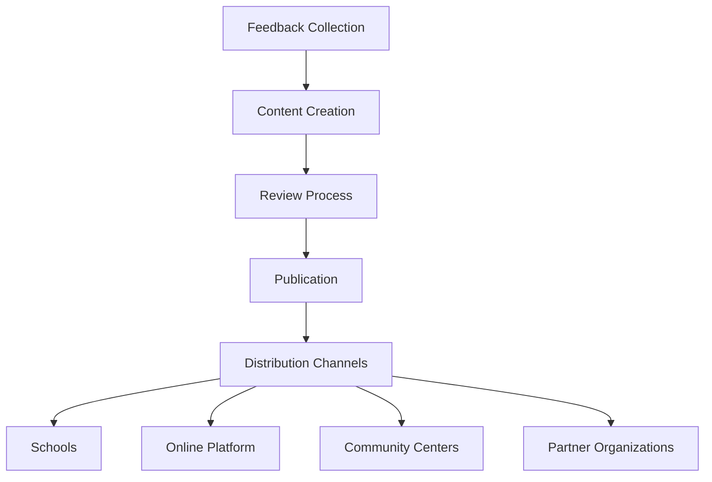

#### Educational Program Flow

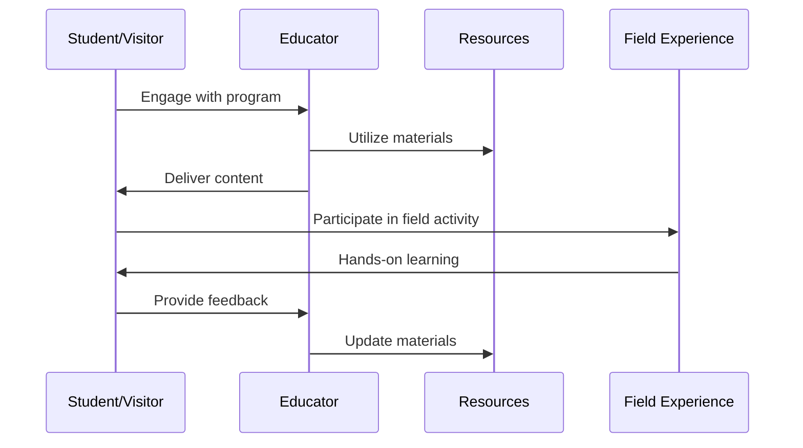

#### Scientific Publication Process

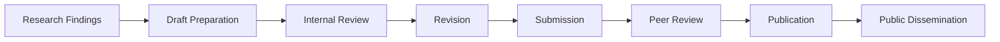

### Community Engagement Systems

#### Volunteer Management System

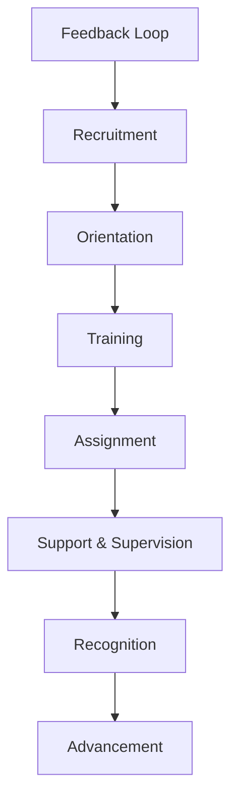

#### Community Event Planning System

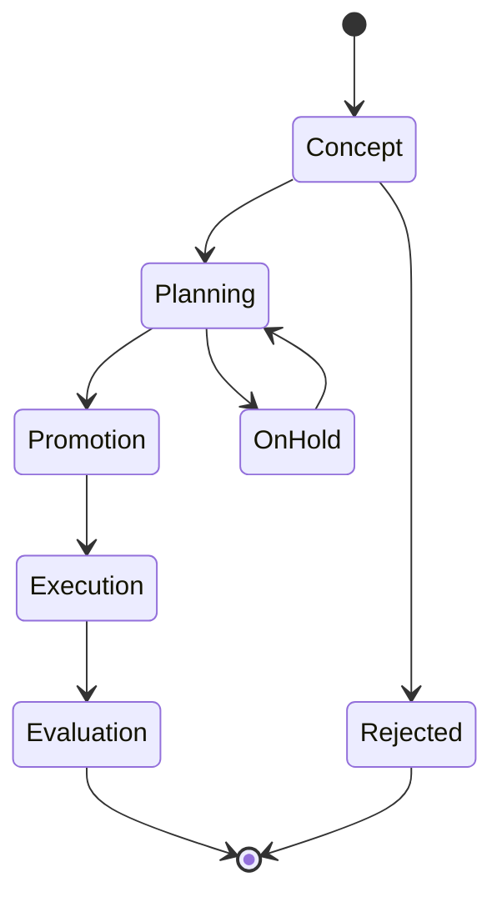

#### Partnership Development Framework

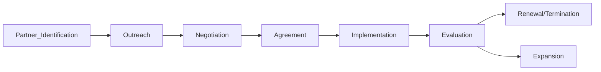

### Administrative Systems

#### Funding Management System

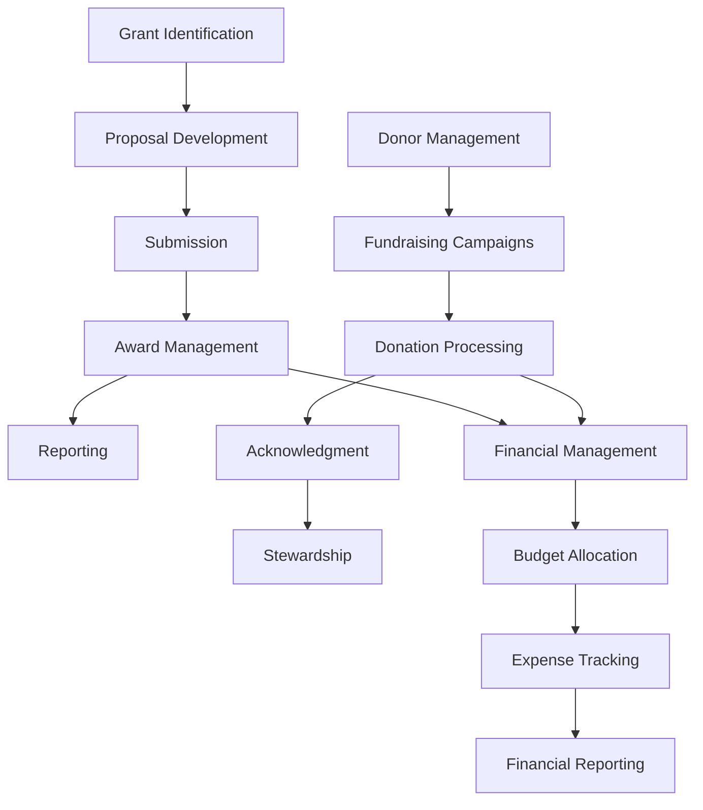

#### Staff Management System

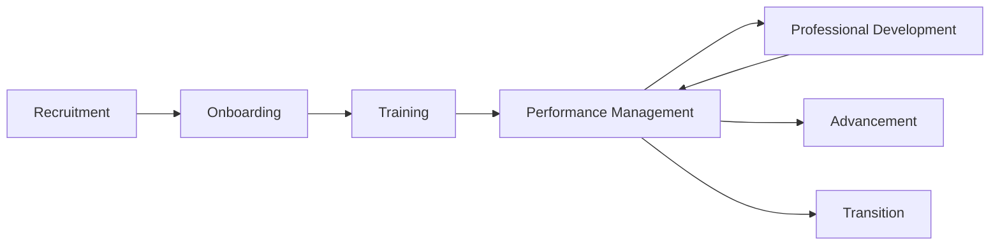

#### Reporting Framework

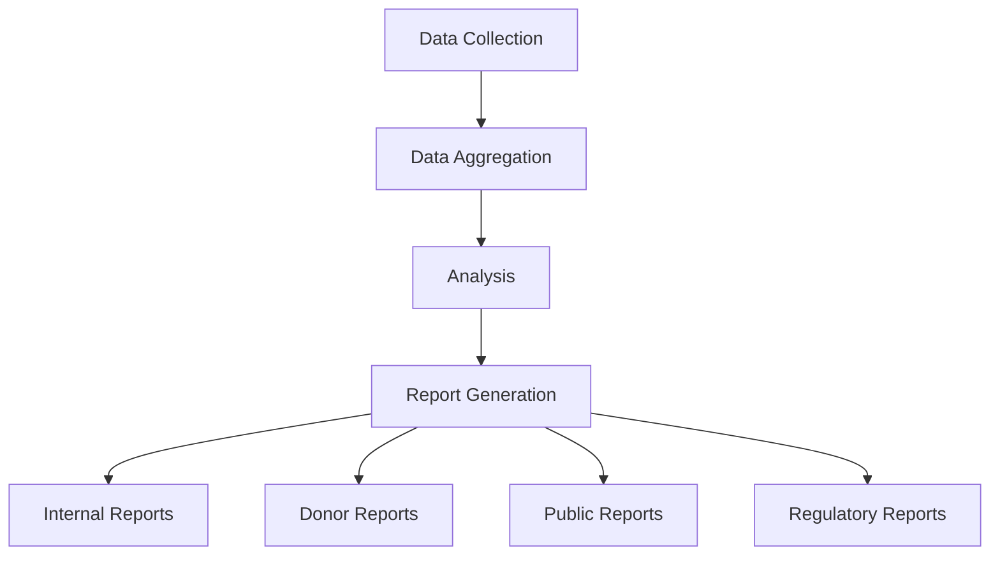

## Next Steps

1. Review this project plan
2. Prioritize systems for initial development
3. Create detailed specifications for each priority system
4. Begin implementation of core systems
5. Develop content for the informational site
6. Launch initial version of the platform

## Timeline

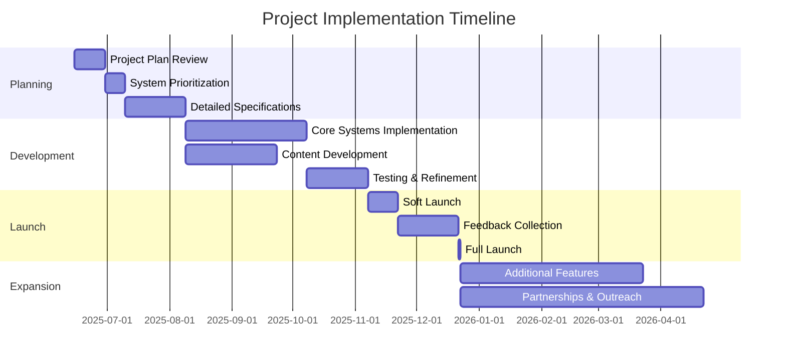
